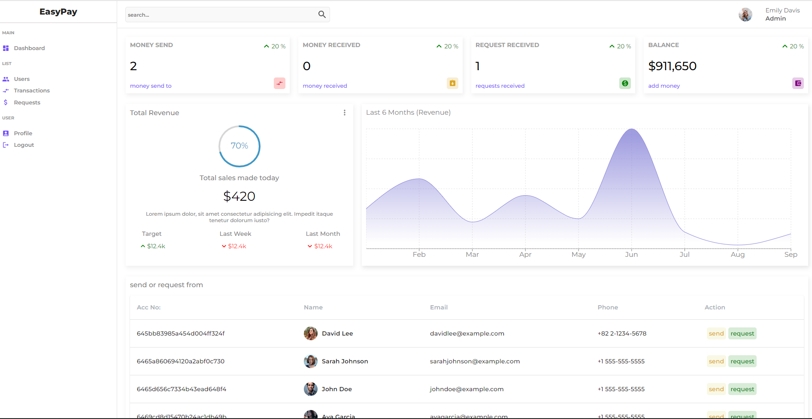

# Wallet Application

The Wallet Application is a full-stack web application built using the **MERN** stack (MongoDB, Express.js, React.js, Node.js) that allows users send money, request money, add balance, accept payment, accept payment requets. It provides a user-friendly interface for organizing transactions and gaining insights into spending habits.

## Technologies Used

**Front-end:** The user interface is developed using React.js initialized using vite, a popular JavaScript library for building dynamic web applications.
for front end data management **redux-toolkit** is also used.

**Back-end:** The server-side of the application is built with **Node.js and Express.js**, providing a scalable and robust foundation.

**Database:** **MongoDB** is utilized as the NoSQL database to store and retrieve financial data efficiently.

**API Integration:** used **cloudinary** service is also used to manage user media's

## Features
 - user login
 - user register
 - user logout
 - user dashboard
 - profile update
 - send money
 - receive money
 - money request
 - view send transactions
 - view received transactions
 - view money requests send from other users
 - accept money request and pay amount
 - add balance to our account
 - verify user after registration (ADMIN)

